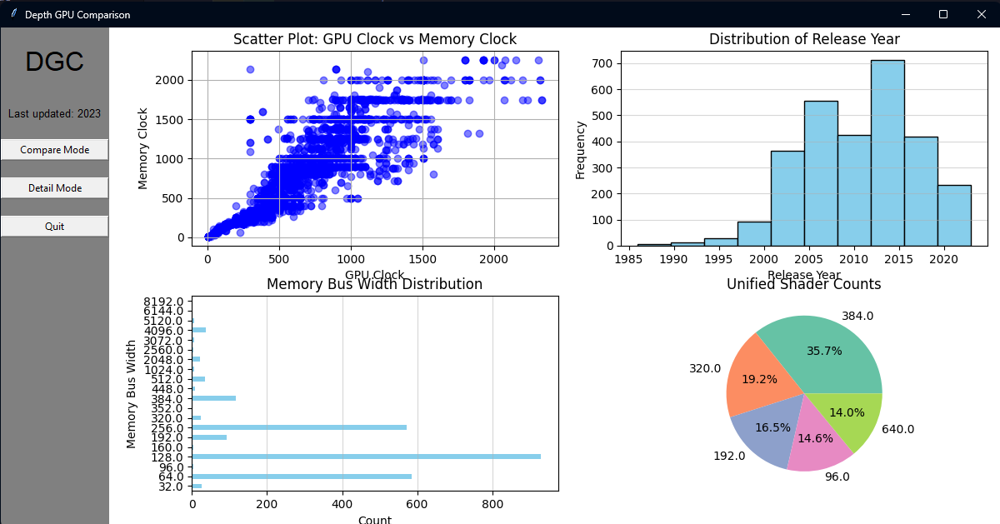
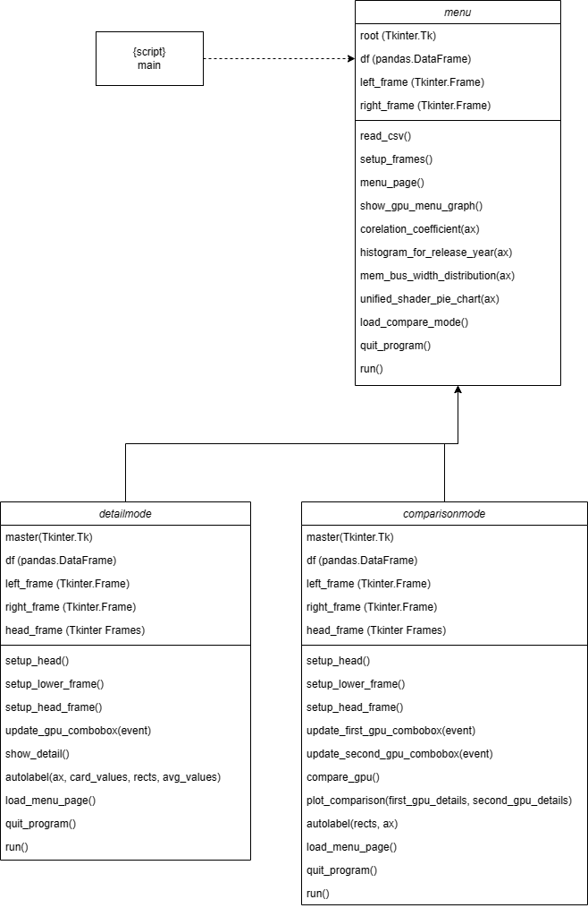

# DEPTH GPU COMPARISON (DGC)
## Descriptions
DGC is a program for user to find the details about their GPU with measure it averages and have other mode for comparison both of this mode will show user a different type of graph and text to allow user to easy to understand.

## Setup
the requirement
* Python at least 3.10.4  `python --version` if lower than please consider install the latest version from [Python.org](https://www.python.org/)
* pandas `pip install pandas`
* matplotlib `pip install matplotlib`
* numpy `pip install numpy`
* tkinter `pip install tkinter`
## How to run
You can start run the program by using
`python main.py`

## Menu (menu.py)

### Description
On the menu, users will see an overall picture of our dataset on the right, where we chose to present important information as a whole so that the user knows the size of the data and display the key values as a graph, while on the left side, a panel that displays the initials and represents the year of the data available, and two buttons that are responsible for navigating the other two layouts.

## CompareMode (compareMode.py)

### Description
This is compare mode it activates after trigger from event button in menu.py it will top bar and the rest is white background after entry input and press compare it will show the rest component that will show details of both GPU, statistics and visual graph

## DetailsMode (detailMode.py)

### Description
this mode will allow user to find it details about their GPU and show them the important data with short summary and statistics to let our user understand their GPU performance and component.

## UML Class diagram

## Uml Sequence diagram
Sequence Diagram for detailMode

## DataSource
* Origin data from : 🟩NVIDIA & AMD🟥 GPUs Full Specs💠 [Kaggle.com](https://www.kaggle.com/datasets/alanjo/graphics-card-full-specs)
* This code under MIT license : [LICENSE](https://github.com/Panthutk/Depth_GPU/blob/master/LICENSE)